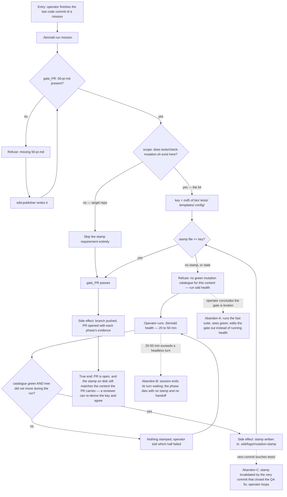

# J-certify-mission-close — Close a mission with a PR gate that proves the kit was measured

The mission this cycle covers exists to make this journey stop lying. Before it, `gate_PR` opened
on the memory that somebody had once run the mutation catalogue; after it, `gate_PR` demands a
stamp on disk keyed to the content it is about to ship.



```yaml
journey:
  id: J-certify-mission-close
  name: Close a mission with a PR gate that proves the kit was measured
  value_statement: "The PR that ships a kit change carries proof that the kit's own assertions ran green over exactly this content — not a memory that someone ran them once."
  personas: [Mara, Sessão]
  entry_points:
    - url: "./bin/sdd run <mission>"
      origin: in-app-nav
    - url: "./bin/sdd why <mission> PR"
      origin: direct
  actions:
    - step: 1
      verb: Finish the last commit that touches bin/, tests/, templates/ or config/
      expected_observable: Working tree clean; sdd status shows every increment done
    - step: 2
      verb: Drive the mission toward the PR phase
      expected_observable: Each earlier gate passes or names exactly what it wants
    - step: 3
      verb: Read why the PR gate refuses
      expected_observable: One sentence naming the missing stamp AND the command that writes it
    - step: 4
      verb: Run ./bin/sdd health and wait for the catalogue
      expected_observable: "score: N caught, 0 known gap(s), of N with caught == N, then 'mutation stamp written'"
    - step: 5
      verb: Re-run the mission
      expected_observable: gate_PR passes without asking for the stamp again
  goal:
    observable: gate_PR passes because a stamp on disk equals the content key of the tree being shipped
    side_effects: [stamp-file-written, branch-pushed, pr-opened]
  true_end_state: >
    The PR is open, and an independent reader can recompute the md5 of bin/ tests/ templates/
    config/ in the pushed tree and get the same value sitting in .sdd/logs/mutation-stamp. The
    green is re-derivable, not reported.
  exit:
    natural: The operator lands on the PR URL; the mission's next act is a human merge.
  abandonment:
    - at_step: 3
      how: The operator reads the refusal, runs the fast suite instead, sees green, and concludes the gate is lying.
      resume: "None — this is the failure mode the sentence's 'since 4c86712 TEST_CMD does not run the catalogue' clause exists to prevent. Verify the clause is still in the message."
    - at_step: 4
      how: A headless session ends its turn waiting for a 20-50 minute command, which ends the session.
      resume: The next session re-derives the phase from disk, finds no stamp, and starts the same 20-50 minutes again.
    - at_step: 5
      how: A QA fix increment or a review fix lands after the stamp, touching tests/, invalidating it.
      resume: Run health again — but nothing warns the operator in advance that the commit they are about to make costs 20-50 minutes.
  crosses: [gate_PR, cmd_health, mutation_stamp_key, tests/check-mutation.sh, the QA-EXEC fix loop]
```

## Notes

The scope condition is an **artifact** question (`is there a tests/check-mutation.sh here?`) and
never a repository-identity question. That is what keeps `J-target-repo-ships` unaffected, and it
is the single largest regression risk in this diff — see `TGT-pr-gate-silent-in-target`.
