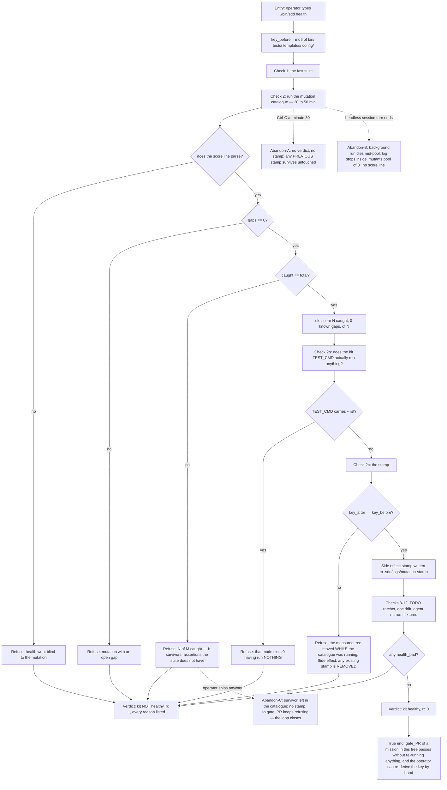

# J-health-verdict — Ask the kit whether it still measures what it claims

`sdd health` answers *"do the kit's own instruments still work?"*. Since `4c86712` it is also the
**only** place the mutation catalogue runs, and since this cycle's I4 the only writer of the stamp
`gate_PR` demands. Three responsibilities, one verdict line.



```yaml
journey:
  id: J-health-verdict
  name: Ask the kit whether it still measures what it claims
  value_statement: "One command answers whether the kit's instruments are still honest, and the answer is re-derivable from disk rather than asserted."
  personas: [Mara, Ada]
  entry_points:
    - url: "./bin/sdd health"
      origin: direct
    - url: "tests/run-all.sh --with-mutation"
      origin: direct
  actions:
    - step: 1
      verb: Run the health command on a clean tree
      expected_observable: "Numbered checks stream by, each as `  ok    <assertion>` or `  FAIL  <assertion>`"
    - step: 2
      verb: Read the mutation score line
      expected_observable: "score: N caught, 0 known gap(s), of N — and the two numbers are compared, not just printed"
    - step: 3
      verb: Read the stamp line
      expected_observable: "mutation stamp written — gate_PR can see that THIS content ran green"
    - step: 4
      verb: Read the final verdict
      expected_observable: "kit healthy with rc 0, or every failing reason listed with rc 1"
  goal:
    observable: A verdict that is false whenever any instrument has stopped measuring
    side_effects: [stamp-written, stamp-removed-on-failure, todo-ratchet-read]
  true_end_state: >
    `kit healthy` is printed only when every check measured something real. Specifically: a
    catalogue with a survivor, a catalogue too small to have measured anything, an unparseable
    score line, and a TEST_CMD that runs nothing must each turn the verdict red — and on any red,
    no stamp may remain on disk.
  exit:
    natural: The operator either proceeds to the PR phase or has a named instrument to repair.
  abandonment:
    - at_step: 1
      how: Ctrl-C during the 20-50 minute catalogue.
      resume: "Nothing was written; a stamp from an earlier run is still there. Whether that surviving stamp is stale is the question — it is keyed on content, so it is valid only if the tree has not moved."
    - at_step: 2
      how: A headless session starts the run in the background and its turn ends; the run dies mid-pool.
      resume: "The log stops inside `mutants (pool of 8)` with no score line. Measured twice in this mission: /tmp/sdd-baseline-score.txt and /tmp/sdd-health-final.log."
    - at_step: 3
      how: A commit lands while the catalogue is running.
      resume: The window guard refuses, removes the stamp, and says the operator's own commit is why — a re-run is the only exit.
  crosses: [cmd_health, tests/check-mutation.sh, tests/run-all.sh, gate_PR, tests/health-baseline.txt, TODO.md]
```

## Notes

Every `  ok    ` / `  FAIL  ` pair prints the **same** assertion text on different streams. That is
the contract the checkpoint Checks anchor on (`^  ok    `, four spaces) and it is what makes Ada's
question answerable: the words carry the verdict, not a colour. Any new line added to this command
inherits that contract.

The 20-50 minute runtime is the journey's dominant constraint and the source of two of its three
abandonment paths. It is not a defect — it is the price of the catalogue — but every surface that
*depends* on this journey completing inherits the risk.
