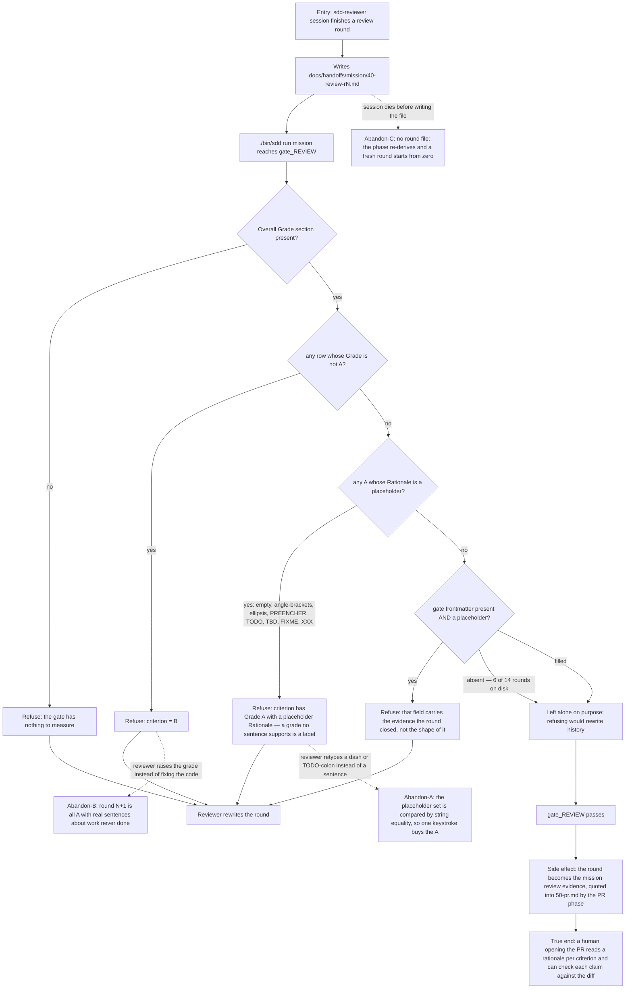

# J-review-round-seal — Seal a review round with grades a sentence supports

The REVIEW phase closes when `40-review-r<N>.md` carries an Overall Grade table of `A`s. This
cycle's I3 made the gate read the column next to the grade, so an `A` has to be *earned by a
sentence* rather than typed.



```yaml
journey:
  id: J-review-round-seal
  name: Seal a review round with grades a sentence supports
  value_statement: "The A on a review round means a reviewer wrote down why, and a human can check the why against the diff."
  personas: [Sessão, Mara]
  entry_points:
    - url: "./bin/sdd run <mission>"
      origin: in-app-nav
    - url: "./bin/sdd why <mission> REVIEW"
      origin: direct
  actions:
    - step: 1
      verb: Write the round file with an Overall Grade table
      expected_observable: One row per criterion, Grade and Rationale both filled
    - step: 2
      verb: Let the gate read it
      expected_observable: Either a pass, or one sentence naming the offending criterion and what is wrong with it
    - step: 3
      verb: Fill the frontmatter gate field with the round's closing evidence
      expected_observable: A filled field passes; a placeholder one is named and refused
  goal:
    observable: gate_REVIEW passes only when every A has a rationale a human can disagree with
    side_effects: [round-quoted-into-pr-body]
  true_end_state: >
    The PR body carries the round's grades AND the sentences behind them, so a reader who never saw
    the review session can check each claim against the diff without asking anyone.
  exit:
    natural: The mission proceeds to DOCS with a reviewable record of what was examined.
  abandonment:
    - at_step: 2
      how: "The reviewer meets the refusal and types the shortest thing that gets past it — a dash, TODO-with-colon, a full stop, WIP."
      resume: "None: the gate accepts it. placeholder() compares the whole cell by string equality against a closed set, so anything outside that set passes. Filed as BUG-20260819-punctuated-rationale-buys-an-a."
    - at_step: 2
      how: The reviewer raises grades rather than fixing what round N found.
      resume: The gate cannot see this; only a human reading the rationales can. It is why the rationale column has to be readable.
    - at_step: 1
      how: The session dies before writing the file.
      resume: The phase re-derives from disk, finds no round, and a fresh session starts — losing the round's findings entirely.
  crosses: [gate_REVIEW, agents/sdd-reviewer.md, templates/review.md, the codereview skill report template, 50-pr.md]
```

## Notes

The legitimate short rationales are `clean`, `n/a` and `—` (em dash) — the `codereview` skill's own
shorthand for *"measured, nothing to say"*. Refusing them would make the gate contradict the skill
it parses. Any new placeholder rule must be probed against `—` **before** shipping: `mawk` is
byte-oriented and the em dash is `E2 80 94`, so a `[[:punct:]]` class over it matches by bytes.

⚠️ **The same table is parsed by `awk -F'|'`, and GFM escapes a literal pipe inside a cell as `\|`.**
The parser does not know that escape. It was harmless while only Grade was read, and became a
refusal the moment the Rationale column turned into a verdict — a real justification reported as a
placeholder and a round blocked for a reason that is not true (`53586c5`). Anything that starts
reading a new column of this table inherits the problem: reassemble the columns first.

The checkpoint table in every mission has the identical trap, documented in its own header. Two
parsers, one repo, same byte.
