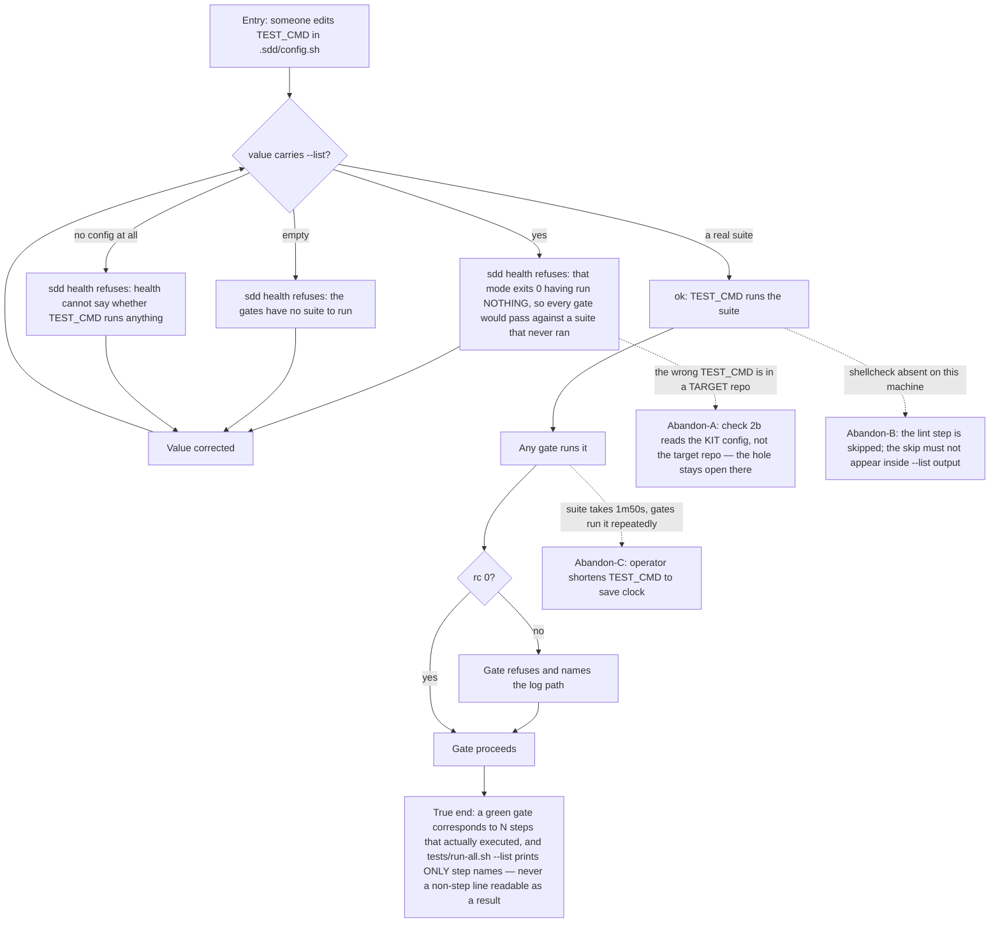

# J-suite-runs-something — Trust that a green suite ran something

`TEST_CMD` is the single key the whole pipeline trusts: `gate_EXEC`, `gate_QA` and `gate_REVIEW`
all run it and believe rc 0. This cycle's I2 closed the hole where a mode that executes nothing was
indistinguishable from a suite that passed.



```yaml
journey:
  id: J-suite-runs-something
  name: Trust that a green suite ran something
  value_statement: "rc 0 from TEST_CMD means work was done, not that a command was well-formed."
  personas: [Mara, Priya]
  entry_points:
    - url: ".sdd/config.sh (TEST_CMD key)"
      origin: direct
    - url: "tests/run-all.sh --list"
      origin: direct
    - url: "./bin/sdd health"
      origin: direct
  actions:
    - step: 1
      verb: Ask the suite what it would run
      expected_observable: Step names only — every printed line is a step, and nothing else
    - step: 2
      verb: Ask health whether the configured TEST_CMD runs anything
      expected_observable: "TEST_CMD runs the suite (...) or a refusal naming which of the three ways it is empty"
    - step: 3
      verb: Run the suite for real
      expected_observable: 14 steps, a summary, rc 0 in about 1m50s
  goal:
    observable: No configuration of TEST_CMD can make a gate pass without the suite executing
    side_effects: [gate-log-written]
  true_end_state: >
    `--list` output and a real run are impossible to confuse, in both directions: the list contains
    no line that is not a step (not even the linter-absent notice), and a TEST_CMD carrying
    `--list` is refused before any gate can trust it.
  exit:
    natural: The operator has a TEST_CMD every gate can rely on.
  abandonment:
    - at_step: 2
      how: The suspect TEST_CMD lives in a target repo's config, not the kit's.
      resume: "Check 2b reads $SDD_HOME/.sdd/config.sh and never $REPO_ROOT's — a deliberate deviation recorded in the checkpoint, with the uncovered half filed in TODO.md. A target repo's TEST_CMD that exits 0 having run nothing is still invisible."
    - at_step: 1
      how: shellcheck is missing on the machine, so the lint step is skipped.
      resume: The run says so; the list must not, or the skip line reads as a step that ran.
    - at_step: 3
      how: The operator shortens TEST_CMD because the suite got 31% slower this mission.
      resume: Nothing stops them, and health checks only for --list — any other nothing-running command passes check 2b.
  crosses: [cmd_health check 2b, tests/run-all.sh, gate_EXEC, gate_QA, gate_REVIEW, .sdd/config.sh]
```

## Notes

Check 2b names exactly one nothing-running spelling (`--list`). That is honest scope, not a hidden
gap — but it means the guard is a denylist of one, and a second such mode would arrive unmeasured.
Recorded as a watch item, not a bug: no second mode exists today.
