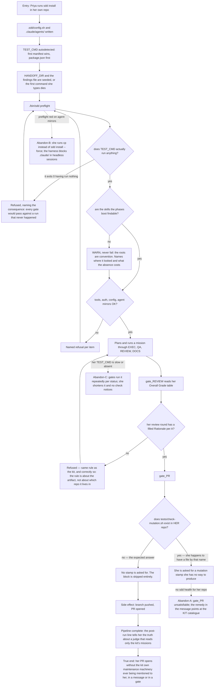

# J-target-repo-ships — Ship a mission from a repo that is not the kit

The canary. Every gate this cycle touched is evaluated in **every** repo the kit drives, and the
kit is only one of them. This journey is the adjacent walk that proves the kit's own maintenance
machinery did not leak into somebody else's repository.



```yaml
journey:
  id: J-target-repo-ships
  name: Ship a mission from a repo that is not the kit
  value_statement: "A team adopting the kit gets the pipeline's discipline without inheriting the kit's own self-maintenance."
  personas: [Priya]
  entry_points:
    - url: "sdd install"
      origin: direct
    - url: "sdd preflight"
      origin: direct
    - url: "sdd run <mission>"
      origin: in-app-nav
  actions:
    - step: 1
      verb: Install the kit into a repo that is not the kit
      expected_observable: Config, agent mirrors, the handoff root and the findings file all written; preflight green or refusing something in HER repo
    - step: 2
      verb: Drive a mission to the PR phase
      expected_observable: Every gate refusal names something in HER repo
    - step: 3
      verb: Reach gate_PR
      expected_observable: No mention of a mutation catalogue or a stamp — the scope block is skipped
  goal:
    observable: The PR opens with no kit-only requirement having been evaluated against her repo
    side_effects: [branch-pushed, pr-opened]
  true_end_state: >
    Her PR is open and, reading back every gate message the run produced, none names
    tests/check-mutation.sh, sdd health's catalogue, or a stamp. The scope condition is an artifact
    question, so a repo without the artifact never sees the question.
  exit:
    natural: She merges her own PR and plans a second mission.
  abandonment:
    - at_step: 3
      how: Her repo happens to contain a file called tests/check-mutation.sh that is not the kit's catalogue.
      resume: "She is asked for a stamp only sdd health writes, and sdd health measures the kit, not her repo. Low likelihood, unbounded cost — the scope is a filename."
    - at_step: 1
      how: Preflight reports stale agent mirrors and she reaches for cp.
      resume: "sdd install --force is the only sync path; the harness treats .claude/ as sensitive and denies Edit/cp in headless sessions. Two DOCS phases in the kit's own history burned a session here."
    - at_step: 2
      how: Her TEST_CMD is slow, so she trims it — to `true`, to `--collect-only`, to something that returns instantly.
      resume: "Since `41f6c34` the preflight refuses it in HER repo and names the consequence. Before that, `sdd health`'s check 2b read the KIT's config and never hers, so a no-op passed every gate in every mission for ever. ⚠️ This abandonment path was recorded as safe-because-unreachable in the previous cycle; the diff made that reasoning false, which is why an abandonment path is re-read every cycle rather than trusted."
    - at_step: 1
      how: She installs and immediately runs `sdd status` or plans a mission.
      resume: "Since `04d0e00` the installer seeds HANDOFF_DIR and the findings file. Before it, `resolve_mission` died on the first command she typed — 'docs/handoffs/ does not exist in the target repo' — with nothing telling her the installer should have made it."
    - at_step: 2
      how: The `ticket`, `qa-report`, `qa-execution` or `codereview` skill is not installed on her machine.
      resume: "The preflight WARNS (never fails — the roots are convention, not contract) and names both the roots it searched and the cost: the phase boots the skill by name anyway, and an absent one means a session that improvises and spends the phase budget."
  crosses: [gate_PR scope condition, gate_REVIEW, cmd_install, cmd_preflight, test_cmd_looks_noop, skill_findable, kaizen_reminder]
```

## Notes

This journey is walked **against the diff**, not against the product's roadmap. It is the canary the
targeted cadence tier requires: the diff changed two gates every target repo runs, and the only
thing between that and a broken adopter is one `[ -f ... ]` test.

⚠️ **Update (branch `20260820-missao-porteira`).** This journey stopped being only a canary and
became a **primary** journey of the cycle: five of the branch's fourteen changes land on Priya's
first two commands.

- `04d0e00` — the installer seeds `HANDOFF_DIR` and the findings file, and the TEST_CMD autodetect
  cascade became `elif` (four independent `if`s meant the *last* match won, so a Node repo carrying
  a `go.mod` was installed with `go test ./...` as the suite every gate runs).
- `41f6c34` — the preflight refuses a `TEST_CMD` that exits 0 having run nothing, in **her** repo.
- `1e20d6c` — the preflight warns about third-party skills it cannot find, asked for **by config**
  (JIRA off ⇒ no `ticket`; no interface ⇒ no `qa-*`; `codereview` always).
- `2a1b4cd` — the post-pipeline line stopped sending her to `sdd kaizen` in the kit, a judge that
  reads a different set of numbers entirely.
- `c8070dc` — five config keys the schema promised and nothing read (`LINT_CMD` and family) left
  the schema, the starter config and the example.

**A previous cycle's reasoning went stale here, and that is the finding worth carrying forward.**
Abandonment path X3 recorded "nothing in the kit inspects a target repo's TEST_CMD at all" as the
reason a trimmed suite was safe. One increment made it false. Abandonment paths are re-read against
the diff every cycle; they are not standing conclusions.
