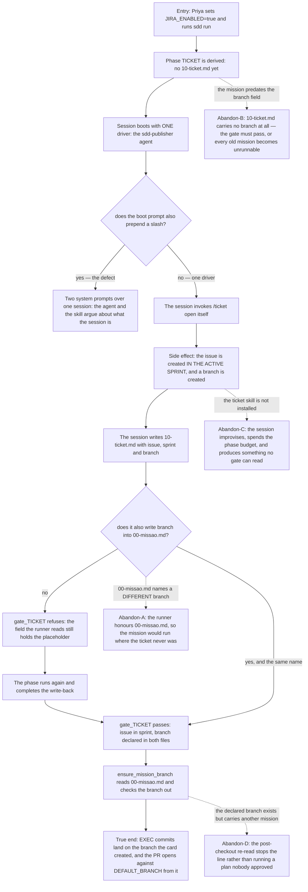

# J-ticket-opens-and-branch-lands — Open the card, and have every later phase commit where the card says

The path this tree had never walked. With `JIRA_ENABLED=false` — the kit's own setting — the TICKET
phase is skipped entirely, so nothing in the previous cycle exercised it. The pilot profile turns it
on, and the phase does two things that outlive it: it creates the issue, and it creates the
**branch** every later phase commits on.



```yaml
journey:
  id: J-ticket-opens-and-branch-lands
  name: Open the mission's card and land every later commit on its branch
  value_statement: "A team with JIRA gets the card in the sprint and the commits in the right place, without a human copying a branch name between two files."
  personas: [Priya, Sessão]
  entry_points:
    - url: "sdd run <mission>"
      origin: direct
    - url: "sdd why <mission> TICKET"
      origin: in-app-nav
  actions:
    - step: 1
      verb: Run a mission with JIRA enabled and no ticket yet
      expected_observable: One TICKET session boots, driven by exactly one thing
    - step: 2
      verb: Let the session create the issue and the branch
      expected_observable: The card is in the active sprint, not the backlog
    - step: 3
      verb: Let the session record its artifacts
      expected_observable: The branch name appears in BOTH 10-ticket.md and 00-missao.md, identical
    - step: 4
      verb: Continue the mission
      expected_observable: The runner checks that branch out and the next phase commits on it
  goal:
    observable: The issue exists in the sprint and the mission's commits are on the branch the ticket created
    side_effects: [jira-issue-created, branch-created, two-artifacts-committed]
  true_end_state: >
    `git log` on the declared branch shows the mission's commits, `10-ticket.md` and `00-missao.md`
    agree on the branch name byte for byte, and the issue is in the active sprint. Checked from the
    repository, never from the session's own summary of what it did.
  exit:
    natural: The mission proceeds to EXEC on the ticket's branch.
  abandonment:
    - at_step: 3
      how: The session records the branch in 10-ticket.md only, as it did before this branch.
      resume: "gate_TICKET refuses and names the artifact the branch has to reach. The write is the SESSION's — a gate that wrote would corrupt moved/moved2, the fingerprints that tell 'the session moved the disk' from 'the session did nothing'."
    - at_step: 3
      how: A mission planned before the branch field existed carries no branch in 10-ticket.md.
      resume: "The gate passes. Refusing would rewrite history instead of measuring the phase that just ran — and would make every pre-existing mission unrunnable."
    - at_step: 2
      how: The `ticket` skill is not installed on this machine.
      resume: "Nothing fails loudly: the session boots, finds no skill, improvises, and spends the phase budget. `sdd preflight` warns about this before a session is opened — that warning is the only thing standing between here and a wasted phase."
  crosses: [gate_TICKET, phase_agent, phase_slash, ensure_mission_branch, the ticket skill, agents/sdd-publisher.md]
```

## Notes

**Never walked before.** The kit's own `.sdd/config.sh` has `JIRA_ENABLED=false`, so every previous
cycle's evidence about this phase is theoretical. That makes this journey the one with the widest
gap between "the code says" and "somebody watched it" — walk it against a real `.jira-project`, or
record explicitly that the walk was simulated and what that leaves unproven.

**The invariant under test is written in the runner itself**, above `phase_agent`: an agent and a
prepended slash are two system prompts fighting over one session. Every other phase obeys it (the
QA sub-steps driven by a skill answer `<none>`); TICKET declared both until this branch. The
observable is in the argv, which `sdd run --dry-run` prints — no stub sees flags, so the projection
is the only place the real command line is readable.

**Class SQ-97 is the cost.** The branch half of this journey exists because five phases once
committed 16 commits into another PR's branch, undone with a `rebase --onto`. The no-JIRA path was
closed first; this is the other half.
