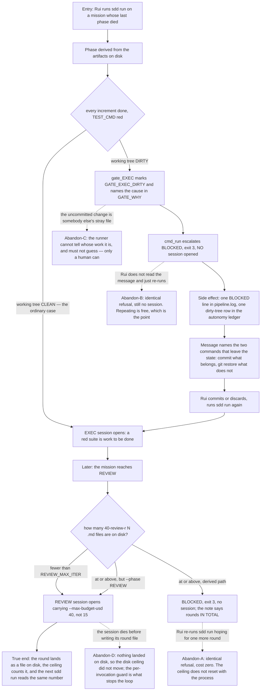

# J-trouble-stops-the-line — A mission that hits trouble stops, instead of spending sessions in a loop

The money journey. Every other journey in this tree asks whether a verdict is honest; this one asks
what a **wrong** answer costs, and how the run ends when the honest answer is "a human has to do
something". Three of the branch's changes live here and they are the same promise seen three times:
the runner stops when it cannot make progress, and it says so before spending anything.



```yaml
journey:
  id: J-trouble-stops-the-line
  name: Stop a mission that cannot make progress, before it spends money
  value_statement: "An operator who left a mission in a broken state pays once to find out, not once per attempt."
  personas: [Rui, Mara]
  entry_points:
    - url: "sdd run <mission>"
      origin: direct
    - url: "sdd run <mission> --phase REVIEW"
      origin: direct
    - url: "sdd why <mission> EXEC"
      origin: in-app-nav
  actions:
    - step: 1
      verb: Re-run a mission whose previous phase died mid-way
      expected_observable: The run ends with exit 3 and a sentence naming WHY, before any session opens
    - step: 2
      verb: Read the refusal and act on it
      expected_observable: The message names the commands that leave the state, not only the state
    - step: 3
      verb: Fix the tree and run again
      expected_observable: The same command now opens the session it refused before
    - step: 4
      verb: Reach REVIEW on a mission that already spent its rounds
      expected_observable: Refused on the derived path, allowed on --phase, and the note says which
  goal:
    observable: The run ends on a named cause with zero new sessions spent on the phase that could not progress
    side_effects: [pipeline-log-line-written, autonomy-ledger-row-written]
  true_end_state: >
    The run exited 3, the mission's pipeline.log carries exactly one BLOCKED line for the phase and
    NO new session line for it, the autonomy ledger carries the matching escalation row, and running
    the identical command a second time produces the identical refusal at the identical cost. The
    end state is checked in the journal, not in the terminal: the terminal scrolls, the journal is
    what the next cycle and the kaizen judge read.
  exit:
    natural: Rui commits or discards, re-runs, and the pipeline moves.
  abandonment:
    - at_step: 1
      how: He re-runs without reading the message, several times.
      resume: "Every attempt must cost zero. A refusal that is cheap to repeat is a refusal a human can ignore safely; one that spends a session per attempt is the loop this journey exists to close."
    - at_step: 3
      how: The uncommitted change is not his — a stray file, another branch's work.
      resume: "The runner must not guess whose work it is, and must not discard it. It names both directions (commit / restore) and stops."
    - at_step: 4
      how: A REVIEW session dies before writing its 40-review-r<N>.md.
      resume: "The disk ceiling did not move, because nothing landed. The per-invocation guard (phase_budget REVIEW) is what stops that loop; the two ceilings answer different questions and both have to be present."
  crosses: [gate_EXEC, cmd_run jidoka branches, review_rounds_on_disk, phase_budget_usd, the autonomy ledger]
```

## Notes

**Why the three changes are one journey.** They look unrelated in the diff (a gate marker, a
ceiling helper, three config keys) and they are the same promise: *trouble ends the run cheaply*.
The per-phase budget (`BUDGET_REVIEW_USD`) belongs here because a REVIEW session that dies on a
ceiling meant for a PR body is trouble arriving through the money door — the failure mode is the
same shape, and it was measured at US$ 23,13 against a US$ 25 ceiling in `catraca-do-backlog`.

**The differential is the assertion, not the escalation.** Every scenario here has a twin that must
still *work*: a red suite over a clean tree still opens a session, a REVIEW under its ceiling still
runs, `--phase REVIEW` still runs. A runner that escalated on all of them would satisfy the
escalation half of this journey while making the pipeline unusable. Walk both sides or the walk
proves nothing.

**Measured cost of the bug this closes:** about US$ 25 per lap, with no end condition, because
`state_fingerprint` reads HEAD, the mission listing and the checkpoint's md5 — never the working
tree — so `attempts` restarted on every `sdd run`.
